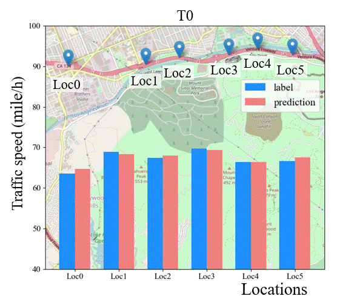
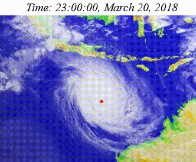

# Delay-Embedding-based-Forecast-Machine
The source code of paper "Multi-step-ahead Prediction from Short-term Data by Delay-Embedding-based Forecast Machine".

## Data avalability
For the reason that all the data files are too large, thus all datasets can be download from [Google Drive](https://drive.google.com/open?id=1MLwkQ4APxGHVxnTFOM_TShdHQRJg8dzX). After downloading the zip file, you should extract all dataset folders in the zip file to the target folder `logs/data/`

## Environment requirements

- python = 3.6
- tenforflow = 2.1
- cuda-version = 10.1
- cudnn-version = 7.6.5

We suggest that you run the code with Pycharm.

## Training and making predicitons

All the training codes and predicting codes corresponding to different datasets are located at `forecast/` 

## Experiment reuslts

(a)

The dynamical changes of the predicted and real traffic speeds in these six locations. 

(b)

The predicted and real moving routes of typhoon Marcus starting from 23:00:00 3/20/2018 to 22:00:00 3/21/2018.